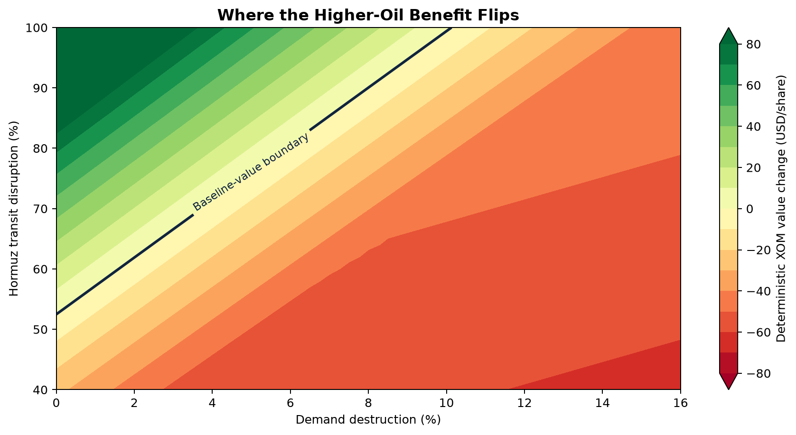
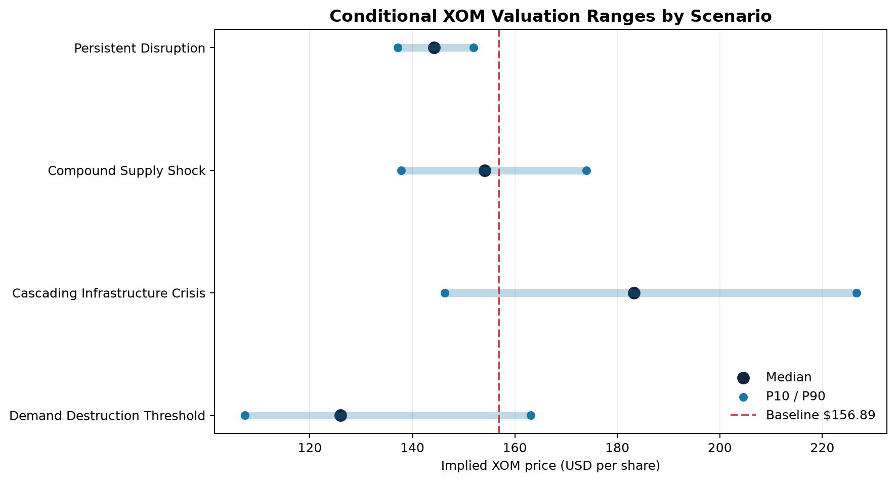
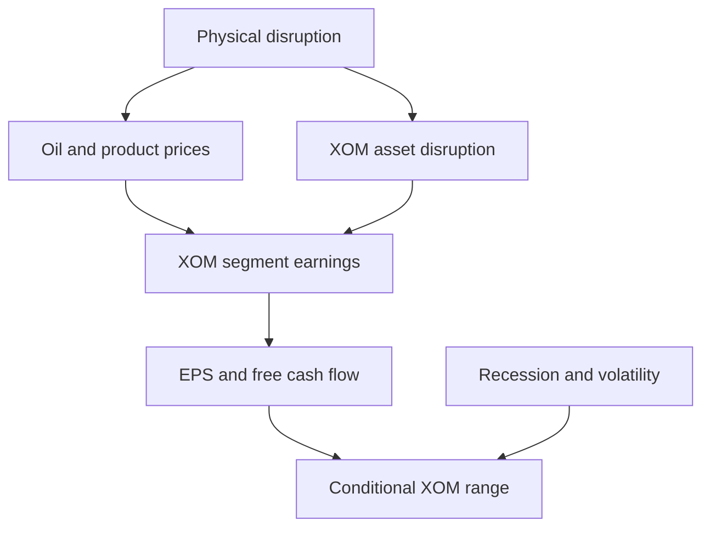

# XOM Compound Oil Shock Equity Stress Model

[](https://www.python.org/)
[](https://github.com/jasonrkeen/xom-compound-oil-shock-model/actions/workflows/ci.yml)
[](LICENSE)
[](MODEL_CARD.md)

A transparent Python model for estimating how a prolonged Strait of Hormuz
closure, combined with attacks on Russian and Black Sea oil infrastructure,
could affect ExxonMobil's segment earnings, free cash flow, and conditional
share-price range.

> **Core research question:** At what point does a compound global oil-supply
> shock stop benefiting ExxonMobil shareholders?



## Why this project matters

The common intuition is straightforward: oil supply falls, oil prices rise, and
ExxonMobil benefits. That relationship is incomplete.

ExxonMobil can gain from higher upstream realizations and stronger refining
margins while simultaneously facing:

- Tengiz and CPC volume exposure;
- freight, insurance, security, and working-capital costs;
- chemical-margin pressure;
- demand destruction and recession;
- a higher equity risk premium and valuation-multiple compression.

The model tests those positive and negative channels together instead of
applying one historical oil beta to XOM.

## Baseline findings

The publication baseline uses the July 23, 2026 XOM close of $156.89 and Brent
close of $100.69 per barrel. Each scenario contains 10,000 Monte Carlo draws.

| Scenario | Median XOM value | P10 | P90 | Probability above baseline |
| --- | ---: | ---: | ---: | ---: |
| Persistent Disruption | $144.23 | $137.13 | $151.96 | 2% |
| Compound Supply Shock | $154.11 | $137.87 | $174.00 | 43% |
| Cascading Infrastructure Crisis | $183.28 | $146.30 | $226.67 | 81% |
| Demand Destruction Threshold | $125.97 | $107.37 | $163.06 | 14% |

The central result is nonlinear. The cascading infrastructure scenario creates
the highest conditional median. Under stronger demand destruction, however,
the modeled median falls below the baseline even though oil remains elevated.



These results are conditional stress estimates, not price targets or
probabilities that the geopolitical scenarios will occur.

## Model architecture



The pipeline contains five analytical layers:

1. **Physical supply:** Hormuz, Russian crude and product losses, CPC, bypass
   capacity, policy offsets, and demand response.
2. **Market prices:** convex Brent response, WTI differential, and a composite
   refining crack spread.
3. **Corporate earnings:** Upstream, Energy Products, Chemical Products,
   Specialty Products, and Corporate and Financing.
4. **Equity valuation:** earnings multiple, free-cash-flow yield, and
   market-factor ensemble.
5. **Uncertainty:** reproducible Monte Carlo ranges and a benefit-flip threshold
   map.

See [Methodology](docs/methodology.md) and [Model Card](MODEL_CARD.md) for
equations, intended use, validation, and limitations.

## Relationship to the existing Hormuz project

This is a firm-specific extension of the
[Global Oil Supply Resilience - Strait of Hormuz Model](https://github.com/jasonrkeen/global-oil-supply-resilience-hormuz-model).
The earlier project evaluates physical market resilience. This repository
translates a physical disruption into an ExxonMobil financial and equity stress
test.

The repositories remain separate so observed market data, physical assumptions,
company assumptions, and valuation outputs are not mixed.

## Repository structure

```text
.
|-- app.py                         # Interactive Streamlit dashboard
|-- main.py                        # Reproducible pipeline entry point
|-- config/
|   |-- model_assumptions.json
|   `-- scenarios.csv
|-- docs/
|   `-- methodology.md
|-- outputs/                       # Selected published baseline artifacts
|-- src/xom_shock_model/
|   |-- data.py                    # Live updates and documented fallbacks
|   |-- engine.py                  # Supply, earnings, and valuation logic
|   |-- models.py                  # Typed model definitions
|   |-- pipeline.py                # End-to-end orchestration
|   |-- reporting.py               # Charts and executive PDF
|   `-- scenarios.py               # Scenario loader
|-- tests/
|   `-- test_model.py
|-- MODEL_CARD.md
`-- CITATION.cff
```

## Quick start

### Windows PowerShell

```powershell
python -m venv .venv
.\.venv\Scripts\Activate.ps1
python -m pip install -r requirements.txt
Copy-Item .env.example .env
python main.py
```

### Reproducible offline run

```powershell
python main.py --offline
```

The default run attempts to update XOM through `yfinance`. When `FRED_API_KEY`
is present in `.env`, it also attempts to update Brent and WTI. Unavailable
series use the documented July 23, 2026 fallback.

### Interactive dashboard

```powershell
streamlit run app.py
```

### Tests

```powershell
python -m pytest -q
```

## Outputs

The pipeline generates:

- scenario-level deterministic and Monte Carlo summaries;
- complete simulation draws;
- market baseline and data-status records;
- machine-readable source and method log;
- valuation-range, macro-offset, distribution, and threshold charts;
- a four-page executive PDF report.

[Read the executive report](outputs/pdf/xom_compound_oil_shock_report.pdf).

## Sources

Primary financial and physical-market baselines are drawn from:

- [U.S. EIA - Strait of Hormuz analysis](https://www.eia.gov/todayinenergy/detail.php?id=65504)
- [ExxonMobil - 2025 results](https://corporate.exxonmobil.com/news/news-releases/2026/0130-exxonmobil-announces-2025-results)
- [ExxonMobil - 2025 Form 10-K](https://www.sec.gov/Archives/edgar/data/34088/000003408826000045/xom-20251231.htm)
- [Reuters - July 2026 CPC and Tengiz disruption](https://www.reuters.com/business/energy/kazakhstans-oil-output-plummets-after-drone-attacks-forced-exporting-terminal-2026-07-23/)
- [Reuters - July 23, 2026 crude close](https://www.reuters.com/business/energy/oil-prices-rise-six-week-high-us-iran-tensions-escalate-2026-07-23/)

Every run records the data status, scenario definitions, model assumptions,
source URLs, draw count, and random seed in
`outputs/source_and_method_log.json`.

## Limitations

- Segment sensitivities are transparent research assumptions, not ExxonMobil
  guidance.
- Public data cannot reproduce company-internal planning.
- The current historical factor component is calibrated rather than estimated
  from a curated event-study dataset.
- Political intervention and tail events are simplified.
- Conditional percentiles are not geopolitical-event probabilities.

## Contributing and citation

See [CONTRIBUTING.md](CONTRIBUTING.md) before proposing a model change. Citation
metadata is available in [CITATION.cff](CITATION.cff). The release sequence is
documented in the [Publishing Checklist](docs/PUBLISHING_CHECKLIST.md).

## License

[MIT](LICENSE)
